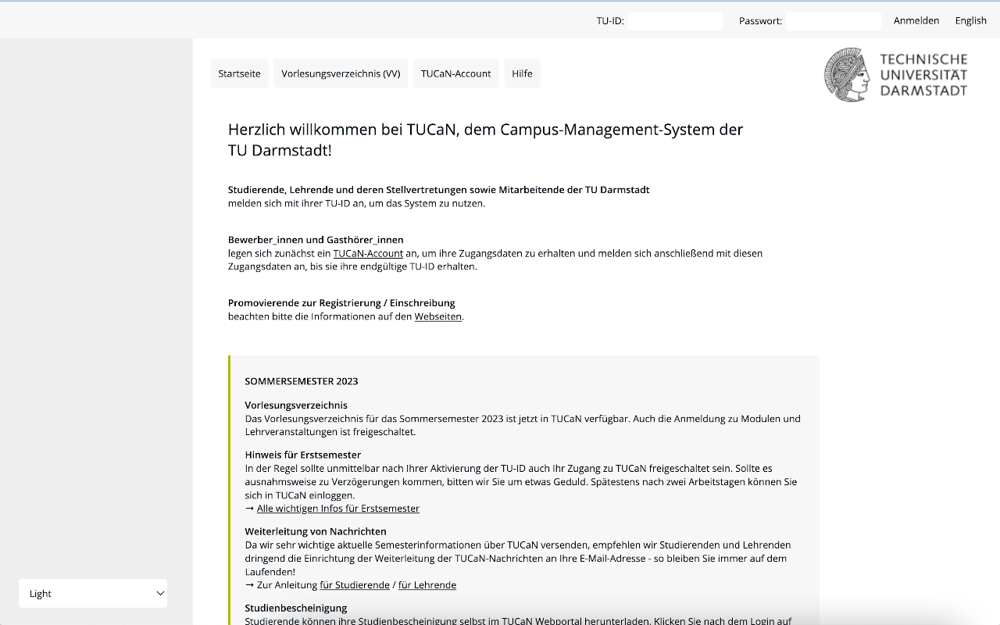

# Installation

1. Download repository
2. Compile .scss files by running `sass --watch styles.scss:dist/styles.css`
3. Open [Chrome Extension Settings](chrome://extensions/)
4. Turn on Developer mode (top right)
5. "Add unpackaged extension"
6. Choose repository folder

# Screenshots

# Attribution

- Toucan icon by: https://icon-library.com/icon/toucan-icon-1.html Toucan Icon # 145560
